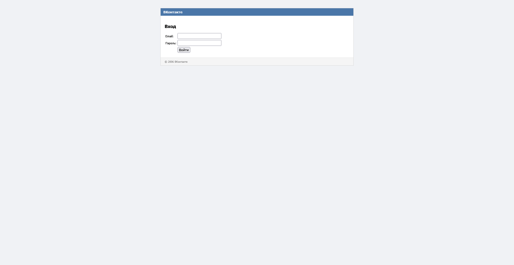
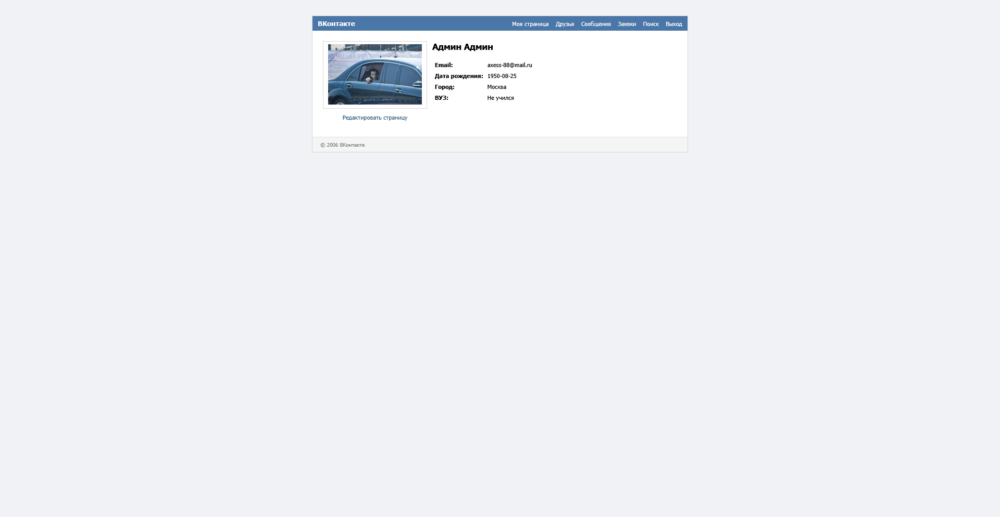
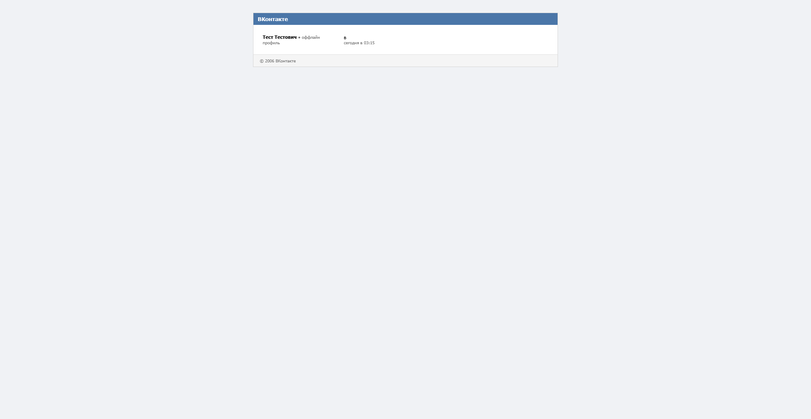
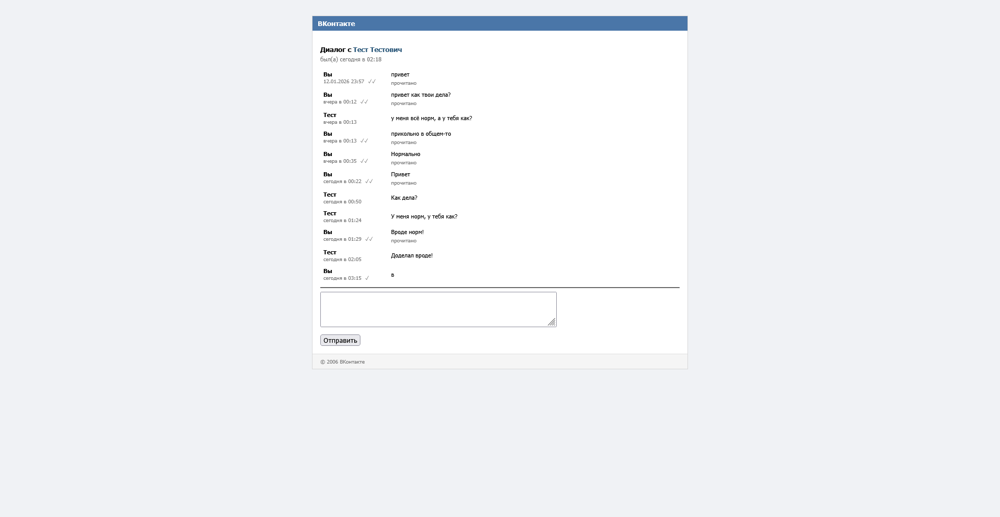
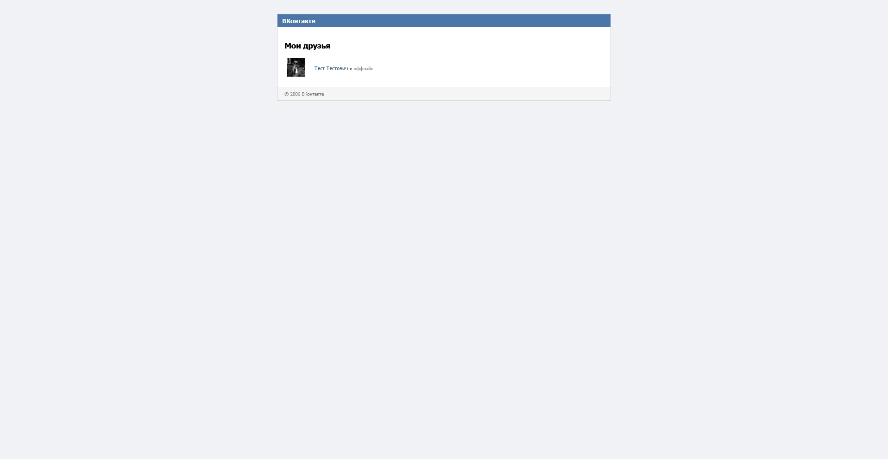

# 🕰️ VK-2006 — Ностальгическая социальная сеть

[](https://php.net/)
[](https://postgresql.org/)
[](LICENSE)
[](https://en.wikipedia.org/wiki/Model–view–controller)
[](https://github.com/smoook92/vk2006/commits/main)
[](https://github.com/smoook92/vk2006)

**Образовательный full-stack проект** — реализация классической социальной сети в стиле ВКонтакте образца 2006 года.  
Чистый PHP, собственная архитектура, PostgreSQL и атмосфера web 1.0.

---

## ✨ Ключевые возможности

### 👤 **Пользователи и профили**
- Регистрация, авторизация, JWT-сессии
- Персонализированные профили с аватарами
- Редактирование информации (статус, интересы, город)
- Публичные страницы (`/id123`)

### 🤝 **Социальный граф**
- Система дружбы с двусторонним подтверждением
- Входящие/исходящие заявки в друзья
- Полнотекстовый поиск пользователей

### 💬 **Общение**
- Система личных сообщений (диалоги)
- Подсчёт непрочитанных сообщений
- Отметка времени последней активности
- Онлайн-статус пользователей

### 🖼️ **Медиа**
- Загрузка и обновление аватаров
- Фотоальбомы (базовый функционал)

---

## 📸 Превью интерфейса

| Главная страница | Профиль пользователя | Диалоги |
|:---:|:---:|:---:|
|  |  |  |
| *Лента активности* | *Персональная страница* | *Список бесед* |

| Диалог | Друзья | Поиск |
|:---:|:---:|:---:|
|  |  |  |
| *Общение в реальном времени* | *Управление друзей* | *Поиск людей* |

---

## 🏗️ Архитектура
```
vk2006/
├── public/ # Public root (document root)
│ ├── index.php # Единая точка входа
│ ├── assets/ # CSS, JS, статические ресурсы
│ └── uploads/ # Загруженные файлы (в gitignore)
├── src/ # Исходный код приложения
│ ├── Controller/ # HTTP-контроллеры
│ ├── Service/ # Бизнес-логика
│ ├── Repository/ # Работа с данными (паттерн Repository)
│ ├── Domain/ # Сущности (User, Message, FriendRequest)
│ ├── Http/ # Request/Response, Middleware
│ └── Security/ # Аутентификация, JWT, CSRF
├── templates/ # HTML-шаблоны (view)
├── config/ # Конфигурационные файлы
├── var/ # Кэш, логи, временные файлы
├── logs/ # Логи приложения
├── vendor/ # Composer-зависимости
├── docs/ # Документация, скриншоты
├── .env.example # Пример переменных окружения
├── db_structure.sql # SQL-дамп структуры БД
├── composer.json
└── README.md
```

### 🔧 **Технологический стек**
- **Backend:** PHP 8.3+ (чистый, без фреймворков)
- **База данных:** PostgreSQL 15+
- **Аутентификация:** JWT (JSON Web Tokens)
- **Шаблонизация:** Нативный PHP (чистые HTML-вставки)
- **Маршрутизация:** Кастомная реализация (Front Controller)
- **Middleware:** CSRF-защита, аутентификация, подсчётчики

---

## 🚀 Быстрый старт

### Предварительные требования
- PHP 8.3+
- PostgreSQL 15+
- Composer 2.5+
- Веб-сервер (Apache/Nginx) с поддержкой mod_rewrite

### 1. Клонирование и настройка
```bash
git clone https://github.com/smoook92/vk2006.git
cd vk2006
```

### 2. Установка зависимостей
```bash
composer install
```
### 3. Настройка окружения
```bash
cp .env.example .env

Отредактируйте .env файл:
DB_HOST=localhost
DB_PORT=5432
DB_NAME=vk2006
DB_USER=postgres
DB_PASS=your_secure_password

JWT_SECRET=your_super_secret_jwt_key_change_me
BASE_URL=http://localhost/vk2006/public
```

### 4. Инициализация базы данных
# Создание БД
```bash
createdb -U postgres vk2006
```

# Импорт структуры
```bash
psql -U postgres -d vk2006 -f db_structure.sql
```

### 5. Настройка веб-сервера

Apache: Убедитесь, что mod_rewrite включен и DocumentRoot указывает на /public
Nginx: Пример конфигурации:
```bash
server {
    listen 80;
    server_name vk2006.local;
    root /path/to/vk2006/public;
    
    index index.php;
    
    location / {
        try_files $uri $uri/ /index.php$is_args$args;
    }
    
    location ~ \.php$ {
        include fastcgi_params;
        fastcgi_pass unix:/var/run/php/php8.3-fpm.sock;
        fastcgi_param SCRIPT_FILENAME $document_root$fastcgi_script_name;
    }
    
    location ~ /\.ht {
        deny all;
    }
}
```

### 6. Права доступа
```bash
chmod 775 public/uploads
chmod 664 var/logs/app.log
```

### 7. Запуск
Откройте в браузере: http://vk2006.local (или ваш адрес)

## 📖 Документация
### 🔐 **Маршруты API/веб-интерфейса**
| Метод | Маршрут | Описание | 🔐 |
|-------|---------|----------|----|
| <span style="color:#10B981">**GET**</span> | `/` | 🏠 Главная страница (лента) | ✅ |
| <span style="color:#10B981">**GET**</span> <span style="color:#F59E0B">**POST**</span> | `/login` | 🔑 Страница входа | ❌ |
| <span style="color:#10B981">**GET**</span> <span style="color:#F59E0B">**POST**</span> | `/register` | 📝 Регистрация | ❌ |
| <span style="color:#10B981">**GET**</span> | `/profile` | 👤 Мой профиль | ✅ |
| <span style="color:#10B981">**GET**</span> <span style="color:#F59E0B">**POST**</span> | `/profile/edit` | ✏️ Редактирование профиля | ✅ |
| <span style="color:#10B981">**GET**</span> | `/id{id}` | 👥 Публичный профиль | ✅ |
| <span style="color:#10B981">**GET**</span> | `/friends` | 🤝 Мои друзья | ✅ |
| <span style="color:#10B981">**GET**</span> | `/friends/requests` | 📨 Заявки в друзья | ✅ |
| <span style="color:#F59E0B">**POST**</span> | `/friends/add/{id}` | ➕ Отправить заявку | ✅ |
| <span style="color:#F59E0B">**POST**</span> | `/friends/accept/{id}` | ✓ Принять заявку | ✅ |
| <span style="color:#10B981">**GET**</span> | `/messages` | 💬 Список диалогов | ✅ |
| <span style="color:#10B981">**GET**</span> | `/messages/dialog?user_id={id}` | 💭 Открыть диалог | ✅ |
| <span style="color:#F59E0B">**POST**</span> | `/messages/send` | ✉️ Отправить сообщение | ✅ |
| <span style="color:#10B981">**GET**</span> | `/search?q=запрос` | 🔍 Поиск пользователей | ✅ |
| <span style="color:#10B981">**GET**</span> | `/photos` | 🖼️ Мои фотоальбомы | ✅ |
| <span style="color:#F59E0B">**POST**</span> | `/logout` | 🚪 Выход | ✅ |

### 🗄️ **Основные таблицы БД**
- `users` — пользователи системы
- `profiles` — расширенные данные профилей
- `friend_requests` — заявки в друзья
- `friends` — подтверждённые дружеские связи
- `messages` — личные сообщения
- `photos` — загруженные изображения
- `sessions` — активные JWT-сессии

🧪 Разработка
Запуск для разработки
# Включить отладку
```bash
echo "APP_ENV=dev" >> .env

# Генерация нового JWT-ключа
php -r "echo base64_encode(random_bytes(32));"
```

Структура запроса
    Front Controller (public/index.php) — точка входа
    Middleware Stack — CSRF, Auth, Counters
    Router — определение контроллера
    Controller — обработка запроса
    Service — бизнес-логика
    Repository — работа с БД
    View — рендеринг шаблона

Пример создания нового функционала
    Добавить маршрут в src/Http/Router.php
    Создать контроллер в src/Controller/
    Реализовать сервис в src/Service/
    Создать репозиторий в src/Repository/
    Добавить SQL-миграцию в db_structure.sql
    Создать шаблон в templates/

🔮 Планы развития
🚀 Ближайшие улучшения
    AJAX-подгрузка сообщений в диалогах
    Уведомления о новых сообщениях (WebSocket/SSE)
    Система лайков и комментариев к фото
    Группы/сообщества

🎨 UI/UX
    Адаптивный дизайн (мобильная версия)
    Темная тема
    Прелоадеры и анимации

⚡ Оптимизация
    Кэширование страниц (Redis/Memcached)
    Оптимизация SQL-запросов (EXPLAIN ANALYZE)
    CDN для загруженных файлов

🧪 Качество кода
    Написание unit-тестов (PHPUnit)
    Интеграционные тесты
    CI/CD пайплайн (GitHub Actions)
    Статический анализ (PHPStan, Psalm)

Полный список задач смотрите в TODO.md.